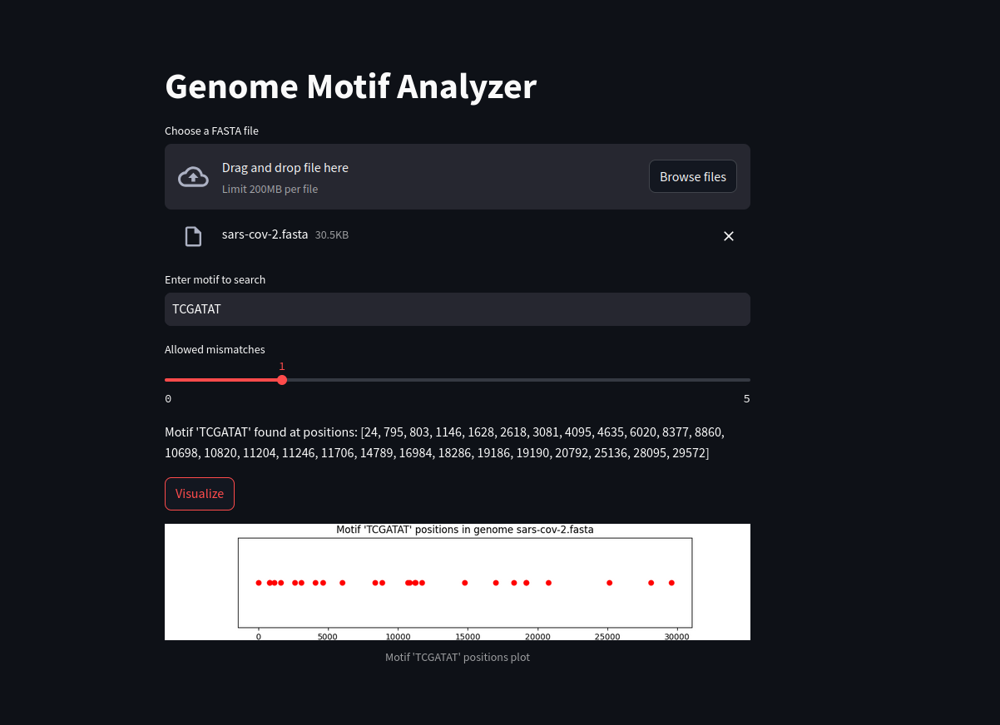

# **Genome Motif Analyzer (GMA)**

## **Table of Contents**

1. [Project Overview](#project-overview)
2. [Theoretical Background](#theoretical-background)
3. [Features](#features)
4. [Installation](#installation)
5. [Usage](#usage)
   - [Command-Line Interface (CLI)](#command-line-interface-cli)
   - [Streamlit Web Application](#streamlit-web-application)
6. [Visualization Examples](#visualization-examples)
7. [Project Structure](#project-structure)
8. [Future Enhancements](#future-enhancements)
9. [Contributing](#contributing)
10. [License](#license)

---

## **Project Overview**

**Genome Motif Analyzer (GMA)** is a Python-based bioinformatics tool designed to help scientists and researchers analyze DNA sequences for specific motifs. By leveraging the Biopython library, GMA allows users to:
- **Parse genome sequences** from FASTA files.
- **Search for DNA motifs**, including exact matches and approximate matches (with allowed mismatches).
- **Visualize motif positions** along the genome, helping researchers better understand sequence patterns and potential regulatory elements.
- Provide **an interactive and user-friendly interface** via a command-line tool and a web-based application.

This tool is designed for ease of use, efficiency, and scalability, making it ideal for bioinformatics analyses involving genome sequence patterns.

---

## **Theoretical Background**

### **What is a DNA Motif?**
In genomics, a **DNA motif** refers to a recurring sequence pattern within DNA that holds biological significance. Motifs can be small sequences of nucleotides that function as transcription factor binding sites, regulatory elements, or even signals for protein-DNA interactions.

Motifs can be exact (e.g., `ATGCG`) or approximate (where slight variations are allowed), and they play a crucial role in understanding genetic regulation, disease mutations, and evolutionary patterns.

For example:
- **Promoter motifs** often indicate regions upstream of genes where transcription begins.
- **Repetitive elements** like microsatellites or tandem repeats can be linked to genetic disorders or evolutionary events.

### **Why Search for Motifs?**
Identifying motifs within genomes can:
- Highlight regions with potential regulatory roles.
- Provide insights into gene function and expression control.
- Reveal evolutionary conservation and divergence between species.

By searching for motifs in genomic data, scientists can unlock hidden biological meaning behind sequence patterns and predict their impact on cellular functions.

---

## **Features**

- **Motif Search**: Search for exact or approximate motifs (with a user-defined number of allowed mismatches).
- **Command-Line Interface**: Quickly analyze genomes directly from your terminal using a variety of command-line options.
- **Streamlit Web App**: A user-friendly web interface for visualizing motifs and interacting with the genome sequences.
- **Visualization**: Generate and save high-quality plots of motif positions along the genome sequence.
- **Multiple Input Methods**: Accepts genome sequences via file uploads (FASTA format) or directly as strings.

---

## **Installation**

### **Requirements**
- Python 3.10+
- Required libraries: `Biopython`, `Matplotlib`, `Streamlit`

### **Step-by-Step Installation**

1. Clone this repository to your local machine:
   ```bash
   git clone https://github.com/your-username/genome-motif-analyzer.git
   cd genome-motif-analyzer
   ```

2. Set up a virtual environment:
   ```bash
   python -m venv venv
   source venv/bin/activate  # For Windows: venv\Scripts\activate
   ```

3. Install the required dependencies:
   ```bash
   pip install -r requirements.txt
   ```

4. (Optional) Install the package locally:
   ```bash
   pip install -e .
   ```

---

## **Usage**

### **Command-Line Interface (CLI)**

The GMA provides a command-line interface (CLI) for quick genome analysis. Here are the basic commands:

#### **Search for a Motif**:

```bash
python gma-cli.py genomes/test.fasta --motif ATGCG
```

This command will search for the motif `ATGCG` in the provided FASTA file.

#### **Allowing Mismatches**:

```bash
python gma-cli.py genomes/test.fasta --motif ATGCG --mismatches 2
```

This searches for the motif `ATGCG` with up to 2 allowed mismatches.

#### **Visualize and Save the Motif Plot**:

```bash
python gma-cli.py genomes/test.fasta --motif ATGCG --visualize --output visualization.png
```

This command will generate a plot of the motif positions and save the visualization to `visualization.png`. If `output` is not provided, it will be saved in the `visualizations` directory.

### **Streamlit Web Application**

The project also includes a modern web-based interface using Streamlit. This app provides basic interface as can be seen below:



To run the Streamlit app:

1. Start the Streamlit server:
   ```bash
   streamlit run app.py
   ```

2. Navigate to `http://localhost:8501` in your browser.

#### **Features of the Web App**:
- **Upload Genome Files**: Upload a FASTA file for analysis.
- **Motif Search**: Input a motif and specify allowed mismatches.
- **Visualization**: Display a real-time plot of the motif positions along the genome.

---

## **Visualization Examples**

- **Motif `TCG` found in the Sars-CoV-2 genome:**


- **Motif `TCGATAT` found in the Sars-CoV-2 genome:**


---

## **Future Enhancements**

We have plans to expand GMA's functionality with the following features:

1. **Support for RNA/Protein Motifs**: Extend the tool to handle RNA sequences and protein motifs.
2. **Multiple Motif Search**: Simultaneously search for multiple motifs and visualize their overlap.
3. **Motif Clustering**: Identify clusters of motifs that may indicate functional regulatory elements.
4. **Integration with Public Databases**: Automatically pull sequences from NCBI or Ensembl directly within the app.

---

## **Contributing**

We welcome contributions to the Genome Motif Analyzer project! To contribute:

1. Fork the repository.
2. Create a new branch for your feature or bugfix.
3. Submit a pull request, and make sure to include tests for your changes.

For significant changes, please open an issue first to discuss what you'd like to change.

---

## **License**

This project is licensed under the MIT License. See the [LICENSE](LICENSE) file for more information.