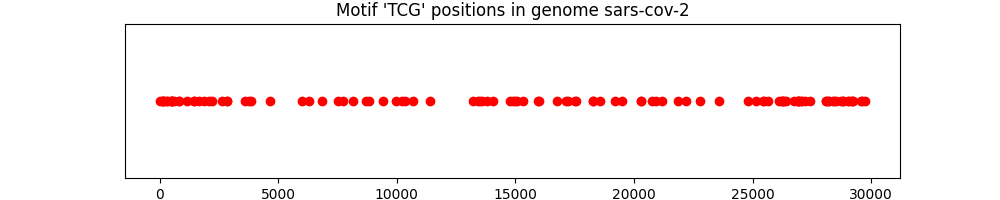
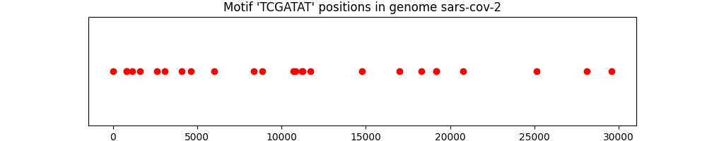

# **🌿 Genome Motif Analyzer (GMA)**

A simple, yet elegant tool for identifying, analyzing, and visualizing DNA motifs in genome sequences.


---

## **Table of Contents**

1. [✨ Project Overview](#project-overview)
2. [🧬 Theoretical Background](#theoretical-background)
3. [💡 Features](#features)
4. [⚙️ Installation](#installation)
5. [🚀 Usage](#usage)
   - [Command-Line Interface (CLI)](#command-line-interface-cli)
   - [Streamlit Web Application](#streamlit-web-application)
6. [📊 Visualization Examples](#visualization-examples)
7. [🛠️ Project Structure](#project-structure)
8. [🔮 Future Enhancements](#future-enhancements)
9. [🤝 Contributing](#contributing)
10. [📜 License](#license)

---

## ✨ **Project Overview**

**Genome Motif Analyzer (GMA)** is a Python-based bioinformatics tool designed to assist scientists and researchers in identifying specific DNA motifs within genome sequences. Leveraging the powerful **Biopython** library, GMA provides an easy-to-use interface for:

- **Parsing genome sequences** from FASTA files.
- **Searching for DNA motifs**, including exact and approximate matches with customizable mismatch thresholds.
- **Visualizing motif positions** within the genome to help identify regulatory elements, transcription factor binding sites, and other sequence patterns.

The tool is highly customizable, offering a **command-line interface (CLI)** for quick interactions, and a **modern web-based interface (via Streamlit)** for visual analysis and reporting.

---

## 🧬 **Theoretical Background**

### **What is a DNA Motif?**
A **DNA motif** is a short recurring sequence within a genome that holds biological significance. These motifs can act as:

- **Transcription factor binding sites**, guiding the machinery that turns genes on and off.
- **Regulatory elements** that influence gene expression and cellular behavior.
- **Repetitive elements** that may be linked to genetic disorders, mutations, or evolutionary patterns.

Motifs can be **exact sequences** or **approximate sequences** with slight variations (mismatches). Detecting these motifs is vital for understanding gene regulation, evolutionary conservation, and disease mechanisms.

### **Why Analyze Motifs?**
By identifying motifs within genomic data, researchers can:
- Pinpoint potential **functional regulatory elements**.
- Study the **conservation of motifs** across species.
- Investigate the role of motifs in **genetic diseases**, such as those related to repetitive elements like trinucleotide repeats.

---

## 💡 **Features**

- 🔍 **Motif Search**: Find exact or approximate motifs within the genome sequence, with customizable mismatch thresholds.
- 🖥️ **Command-Line Interface (CLI)**: Analyze genome sequences with easy-to-use terminal commands.
- 🌐 **Streamlit Web App**: Explore genome motifs with an intuitive, interactive web interface.
- 📊 **Visualize Motif Positions**: Generate high-quality plots showing motif locations within the genome sequence.
- 📁 **Flexible Input**: Supports genome sequence input via FASTA files or raw sequence strings.

---

## ⚙️ **Installation**

### **Requirements**
- **Python** 3.10+
- Libraries: `Biopython`, `Matplotlib`, `Streamlit`

### **Step-by-Step Installation**

1. **Clone this repository**:
   ```bash
   git clone https://github.com/your-username/genome-motif-analyzer.git
   cd genome-motif-analyzer
   ```

2. **Set up a virtual environment**:
   ```bash
   python -m venv venv
   source venv/bin/activate  # On Windows: venv\Scripts\activate
   ```

3. **Install dependencies**:
   ```bash
   pip install -r requirements.txt
   ```

4. **(Optional) Install the package locally**:
   ```bash
   pip install -e .
   ```

---

## 🚀 **Usage**

### **Command-Line Interface (CLI)**

You can use the CLI for quick motif analysis directly from your terminal.

#### **Example 1: Search for a motif**
```bash
python gma-cli.py genomes/test.fasta --motif ATGCG
```
This command will search for the motif `ATGCG` in the provided FASTA file.

#### **Example 2: Search with mismatches**
```bash
python gma-cli.py genomes/test.fasta --motif ATGCG --mismatches 2
```
Searches for the motif `ATGCG` with up to 2 allowed mismatches.

#### **Example 3: Visualize and save motif plot**
```bash
python gma-cli.py genomes/test.fasta --motif ATGCG --visualize --output visualization.png
```
Generates a plot of motif positions and saves the visualization to `visualization.png`. If no output path is provided, it saves the plot in the `visualizations/` directory by default.

---

### **Streamlit Web Application**

The project also includes a **modern Streamlit web app** for more interactive and visual exploration of genome motifs.

To launch the app:
1. Run the Streamlit server:
   ```bash
   streamlit run app.py
   ```

2. Open your browser and navigate to:
   ```url
   http://localhost:8501
   ```

#### **Streamlit App Features**:
- **Upload Genome Files**: Upload a FASTA file and analyze it in real-time.
- **Motif Search**: Input a DNA motif and specify the number of allowed mismatches.
- **Visualization**: View a dynamic plot showing the positions of the motif within the genome.

---

## 📊 **Visualization Examples**

Below are some examples of motif visualizations generated using **GMA**:

- **Motif `TCG` found in the SARS-CoV-2 genome**:

  

- **Motif `TCGATAT` found in the SARS-CoV-2 genome**:

  

---

## 🛠️ **Project Structure**

```bash
bioseq_analyzer/
├── bioseq_analyzer/
│   ├── __init__.py           # Module initializer
│   ├── genome.py             # Core genome analysis functionality
│   └── utils.py              # Utility functions (if needed)
├── tests/
│   └── test_genome.py        # Unit tests for genome analysis
├── CLI.py                    # Command-line interface for motif analysis
├── app.py                    # Streamlit web application
├── setup.py                  # Setup script for package distribution
├── requirements.txt          # Required libraries
└── README.md                 # Documentation
```

---

## 🔮 **Future Enhancements**

We plan to enhance **Genome Motif Analyzer (GMA)** with the following features:

1. **RNA/Protein Motif Support**: Extend the tool to handle RNA sequences and protein motifs.
2. **Multiple Motif Search**: Enable searching for multiple motifs simultaneously and visualize their overlaps.
3. **Motif Clustering**: Identify clusters of motifs that might indicate functional regulatory elements.
4. **Public Database Integration**: Allow users to automatically fetch sequences from NCBI, Ensembl, and other public databases.

---

## 🤝 **Contributing**

Contributions are highly welcome! To contribute:

1. **Fork the repository**.
2. **Create a new branch** for your feature or bugfix.
3. **Submit a pull request** with details of your changes.

Please ensure that all new features are accompanied by relevant tests.

---

## 📜 **License**

This project is licensed under the **MIT License**. See the [LICENSE](LICENSE) file for more details.

---

Feel free to reach out with questions or suggestions for improvements!